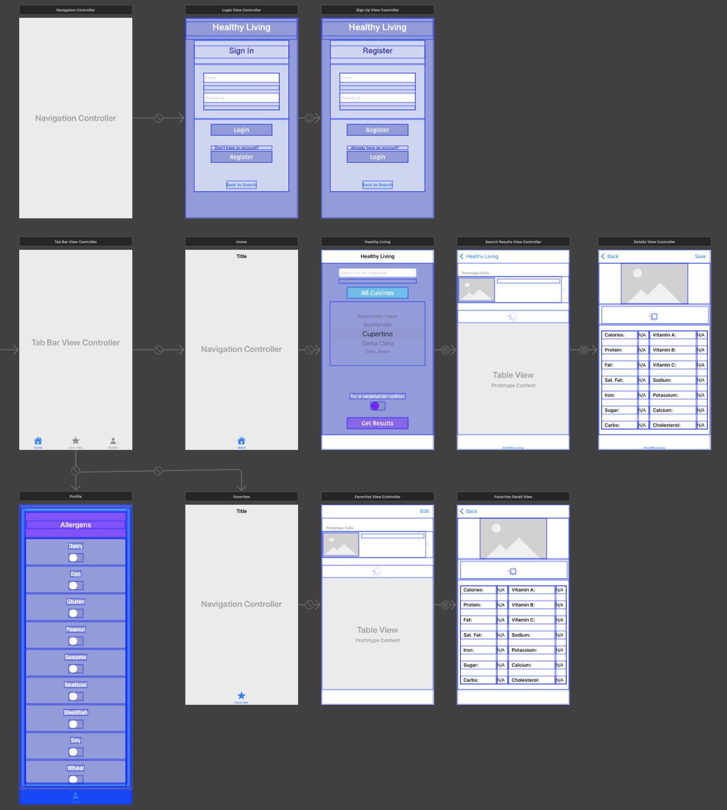
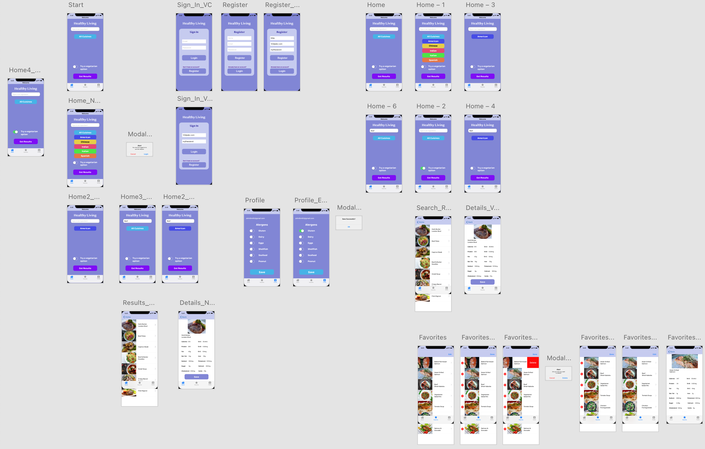
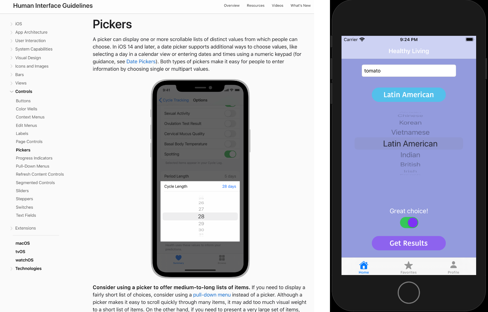
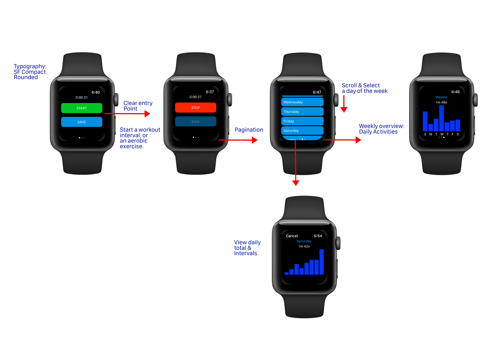
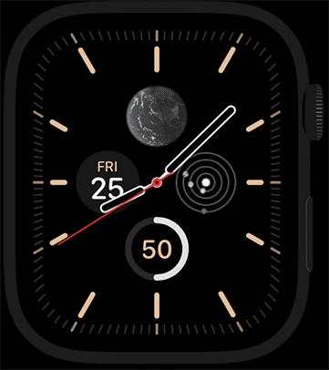

# iOS-Illustrations

## iOS Project & Portfolio

App name: __Healthy Living__

> 'Right click' and open in new tab

* Adobe XD: 

[Application Prototype](https://xd.adobe.com/view/88495071-11e1-48cc-8189-e4a0b9b30895-dd1a/)

__Storyboard Layout__

  

__Prototype__

  

	

	
&nbsp;&nbsp;&nbsp;&nbsp;&nbsp;&nbsp&nbsp;&nbsp;&nbsp;&nbsp;&nbsp&nbsp&nbsp;&nbsp;
   

	

	
	&nbsp;&nbsp;&nbsp;&nbsp;&nbsp;&nbsp&nbsp;&nbsp;&nbsp;&nbsp;&nbsp&nbsp&nbsp;&nbsp;
   

	

## Wearable Project: WatchOS

App Name: __Fitness Counts__

Main concepts: WatchOS workout tracker. Track and display work out time intervals for daily and weekly activities.

	

	
&nbsp;&nbsp;&nbsp;&nbsp;&nbsp;&nbsp&nbsp;&nbsp;&nbsp;&nbsp;&nbsp&nbsp&nbsp;&nbsp;
   

